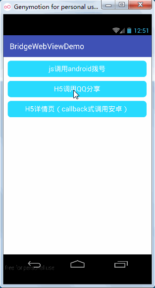
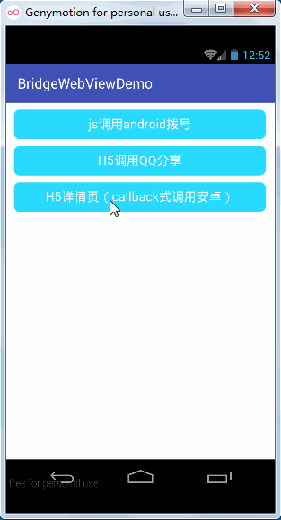
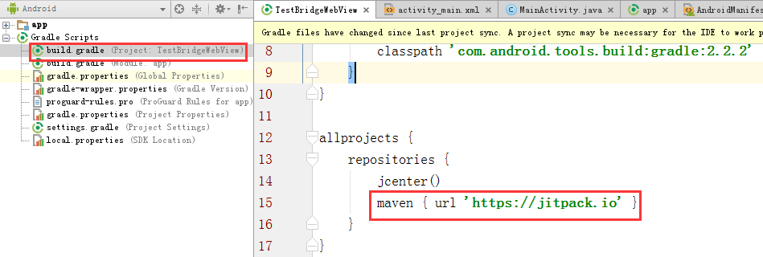

# H5和Android通信容器BridgeWebView的使用
---
开源地址：[https://github.com/open-android/BridgeWebView](https://github.com/open-android/BridgeWebView)

# 运行效果

## 使用步骤

### 1. 在project的build.gradle添加如下代码(如下图)

	allprojects {
	    repositories {
	        maven { url "https://jitpack.io" }
	    }
	}

	

	
### 2. 在Module的build.gradle添加依赖

    compile 'com.github.open-android:BridgeWebView:v1.0'

### 3.布局文件中使用

	<com.itheima.view.BridgeWebView
		android:id="@+id/bdwebview"
		android:layout_width="match_parent"
		android:layout_height="match_parent"/>

### 4.Activity初始化通信桥梁

	mBdwebview = (BridgeWebView) findViewById(R.id.bdwebview);//初始化BridgeWebView
	mBdwebview.loadUrl("http://10.0.3.2:63343/BridgeWebView/index.html");//显示H5页面
	mBdwebview.addBridgeInterface(new MyJavaSctiptInterface(mBdwebview, this));//注册桥梁类，该类负责H5和android通信

### 5.桥梁类提方法给js调用
	
   	public class MyJavaSctiptInterface{
        private Activity mActivity;

        public MyJavaSctiptInterface(Activity mActivity) {
            this.mActivity = mActivity;
        }

        public void callPhone(String[] strs){//拨号
            JSONObject jsonObject = new JSONObject(strs[0]);
            String phone = jsonObject.optString("phone");
            Intent intent = new Intent(Intent.ACTION_CALL, Uri.parse("tel:" + phone));
            mActivity.startActivity(intent);
        }
    }

### 6.js中调用android方法

	$("#btn1").on("click", function(){
        var method = "callPhone";//js调用的android方法名
        var params = {"phone":"10086", "callback":""};//callback用于回调js
        callAndroidMethod(method, params);
    });

	 /**
     * 统一管理js调用安卓方法
     * @param method 方法名
     * @param params 向android传参数 数组格式
     */
    var callAndroidMethod = function(method, params){
        window.jsInterface.invokeMethod(method, [JSON.stringify(params)]);
    }